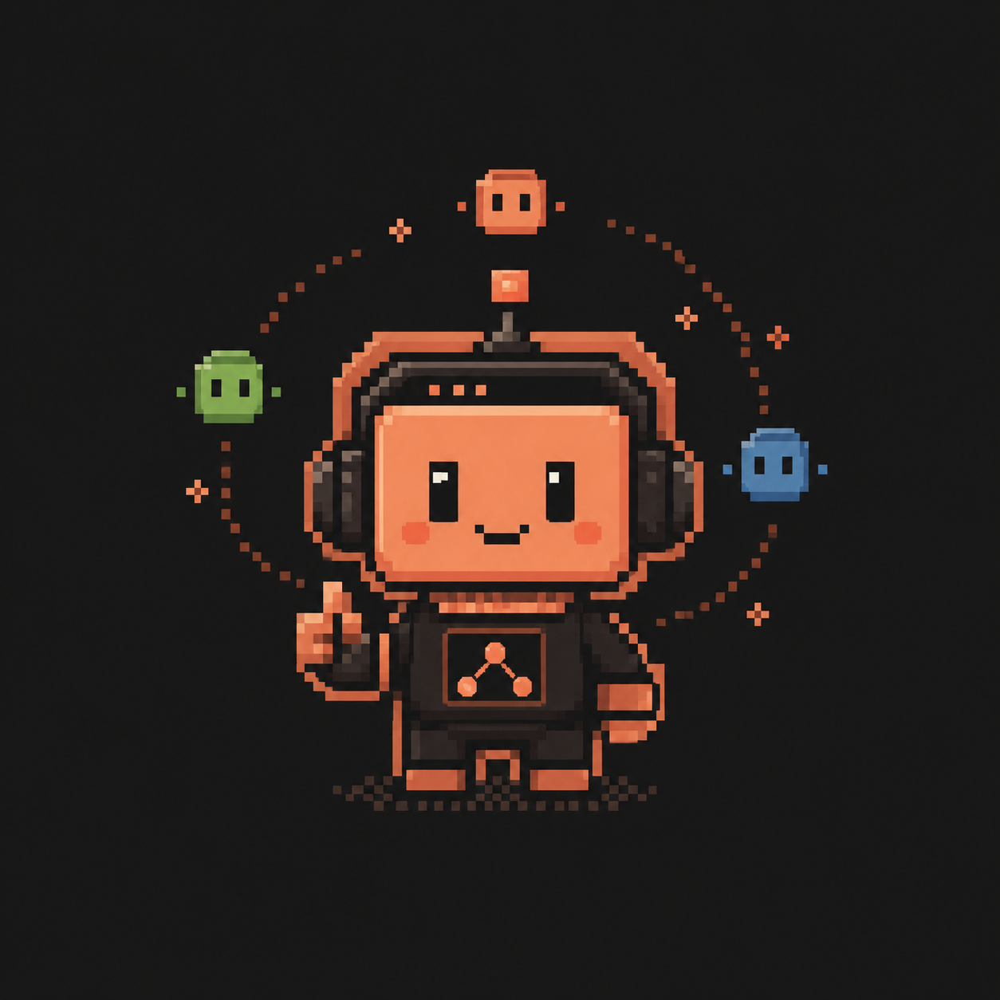
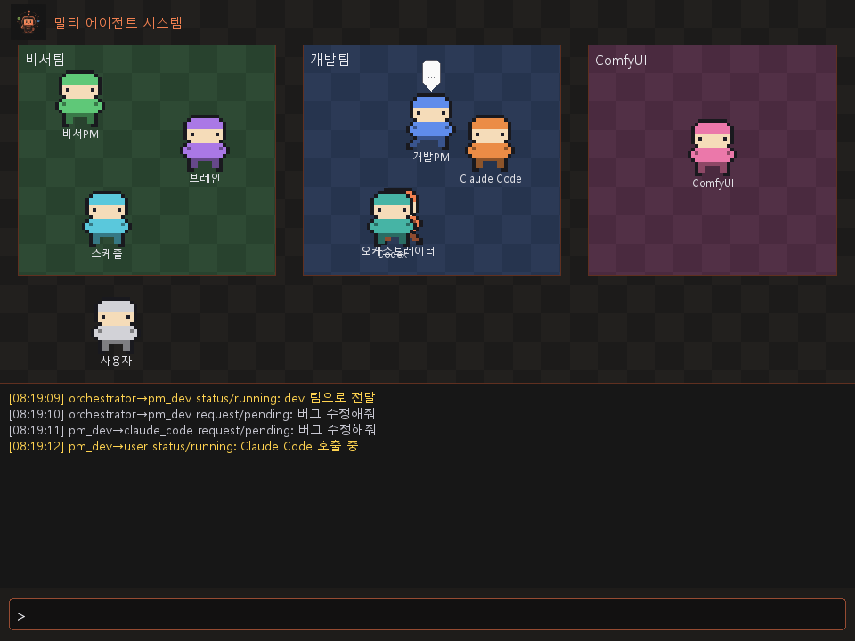

# 멀티 에이전트 시스템

<p align="center">
  
</p>

로컬 LLM(Ollama의 Qwen 분류 모델 + Gemma 12B 브레인 모델)을 사용해 세 팀(개인 비서팀 / 개발팀 / ComfyUI 에이전트)에 태스크를 분배하는 로컬 멀티 에이전트 시스템. Pygame 도트풍 픽셀 RPG UI로 에이전트 간 통신을 시각화한다.



> 상세 설계는 [multi_agent_system_design_v3.md](multi_agent_system_design_v3.md) 참고. 새 컨텍스트에서 작업을 이어갈 때는 설계 문서를 먼저 읽을 것.

---

## 앱이 하는 일 / 기능 목록

이 앱은 사용자가 한 줄로 입력한 요청을 로컬 오케스트레이터가 분석해서 개인 비서팀, 개발팀, ComfyUI 이미지 생성팀 중 맞는 팀으로 보내고, 각 팀의 진행 상황과 결과를 Pygame UI에서 보여주는 로컬 멀티 에이전트 실험 앱이다.

### 1. 공통 오케스트레이션

- 사용자 입력을 받아 `dev` / `personal` / `comfyui` 팀으로 라우팅한다.
- 1차는 키워드 기반으로 빠르게 분류하고, 애매하면 Ollama 경량 모델(`qwen3:4b-instruct`)로 보정한다.
- 분류에 실패하면 사용자에게 `dev / personal / comfyui` 중 하나를 다시 입력하라고 요청한다.
- `안녕`, `hello`, `hi` 같은 인사말은 LLM 호출 없이 fast-path로 즉시 응답한다.
- 모든 통신은 `task_id`, `from`, `to`, `type`, `status`, `payload`, `timestamp`를 가진 message envelope 형식으로 통일한다.
- UI와 백엔드는 `queue.Queue` 2개(`q_in`, `q_out`)로만 연결한다.
- Pygame 메인 스레드와 asyncio 워커 스레드를 분리해 UI가 멈추지 않게 한다.

### 2. Pygame 도트풍 UI

- 사용자의 요청 입력창을 제공하고 한글 IME 입력을 지원한다.
- 사용자, 오케스트레이터, 비서PM, 브레인, 스케줄, 개발PM, Claude Code, Codex, ComfyUI 캐릭터를 맵에 표시한다.
- 요청이 전달되면 캐릭터가 대상 에이전트 쪽으로 이동하고, 진행/성공/실패 상태를 말풍선과 애니메이션으로 표시한다.
- 하단 로그 창에 모든 envelope 흐름을 시간순으로 표시한다.
- 마우스 휠로 로그를 스크롤할 수 있고, 최신 로그 위치로 돌아갈 수 있다.
- 로그 위 태스크 상태 바에서 `진행 중`, `완료`, `실패/타임아웃`을 표시한다.
- 실패 상태는 사용자가 상태 바를 클릭해 확인할 때까지 유지한다.
- ComfyUI 작업 전후의 GPU 모델 전환 상태를 상단 배너로 표시한다.
- 우측 상단 `속도` 버튼으로 토큰 출력 속도 패널을 열고 닫을 수 있다.
- Ollama 호출의 토큰 출력 속도(tok/s)를 그래프로 보여준다.
- 토큰 속도 샘플을 `token_speed_YYYYMMDD_HHMMSS.json` 파일로 내보낼 수 있다.
- `F2`로 개발팀 설정 모드에 들어가 기본 모델, effort, 자율 모드를 변경할 수 있다.
- `--mock` 모드에서 실제 Ollama/CLI/ComfyUI 없이 UI 시나리오를 볼 수 있다.
- `--smoke N` 옵션으로 N프레임 뒤 자동 종료되는 렌더링 스모크 테스트를 실행할 수 있다.

### 3. 개인 비서팀

- 개인 비서PM이 요청을 `brain` 또는 `schedule` 작업으로 다시 분류한다.
- 브레인 에이전트는 `second_brain/ai-index/summary.json`과 `second_brain/SECOND_BRAIN.md`를 기반으로 관련 정리 문서를 찾는다.
- 문서의 `keywords`, `tags`, `related_topics`를 질문과 매칭하고, 동점이거나 애매하면 Ollama로 관련 문서를 보정 선택한다.
- 관련 문서의 제목, 경로, 요약, 매칭된 키워드, 사용한 소스를 payload로 반환한다.
- 세컨드 브레인 파일이 24시간 이상 갱신되지 않으면 stale 경고를 함께 반환한다.
- summary 파일이 없거나 JSON이 깨졌으면 추측하지 않고 error envelope로 반환한다.
- 스케줄 에이전트는 `schedule.json` 기반으로 일정/할일을 관리한다.
- 자연어에서 `추가`, `조회`, `오늘 요약`, `수정`, `삭제` 동작을 rule-based로 파싱한다.
- `오늘`, `내일`, `모레`, `YYYY-MM-DD`, `오전/오후 N시`, `HH:MM` 형식의 날짜/시간을 파싱한다.
- 일정/할일 항목에는 `id`, `title`, `date`, `time`, `kind`, `done`, `created`, `updated` 정보를 저장한다.
- 일정 저장은 임시 파일 작성 후 `os.replace`로 원자적으로 교체하고, 프로세스 내 쓰기는 `asyncio.Lock`으로 직렬화한다.

### 4. 개발팀

- 개발PM이 요청을 분석한 뒤 Claude Code CLI 또는 Codex CLI 중 하나를 호출한다.
- 요청에 `codex`가 명시되면 Codex를 사용하고, 그 외 개발 요청은 Claude Code를 기본으로 사용한다.
- 작업 디렉토리가 지정되지 않으면 `workspaces/<task_id>` 디렉토리를 자동 생성해 사용한다.
- 같은 작업 디렉토리에 대한 개발 작업은 `asyncio.Lock`으로 직렬화한다.
- Claude Code는 `claude -p ... --output-format json --allowedTools Read,Edit,Write,Bash` 형태로 실행한다.
- Codex는 `codex exec --json --skip-git-repo-check ...` 형태로 실행한다.
- CLI stdout을 그대로 노출하지 않고 JSON/JSONL을 파싱해 payload로 변환한다.
- stdout/stderr 무출력 idle timeout, 전체 실행 absolute timeout, 최대 재시도를 적용한다.
- 실패 시 nonzero exit, timeout, 출력 파싱 실패, stderr/stdout tail을 구조화된 error payload로 반환한다.
- 개발 요청의 강도를 `low` / `medium` / `high`로 추정한다.
- 강도 추정은 키워드와 입력 길이를 먼저 보고, 애매하면 Ollama로 보정한다.
- `dev_settings.json`에 기본 모델, 기본 effort, 자율 모드를 저장한다.
- 지원 설정값은 모델 `fable` / `opus` / `sonnet`, effort `low` / `medium` / `high` / `xhigh` / `max`, 모드 `manual` / `auto` / `approval`이다.
- `manual` 모드는 항상 기본 모델/effort로 실행한다.
- `auto` 모드는 작업 강도에 맞춰 모델/effort를 자동 선택하고 변경 사실만 status로 알린다.
- `approval` 모드는 기본 모델과 다른 모델이 제안될 때 사용자에게 승인 요청을 보내고 `y` / `n` 응답을 기다린다.
- approval 응답이 60초 안에 없거나 거부되면 기본 모델/effort로 계속 진행한다.
- UI의 F2 설정 모드에서 `model sonnet / effort high / mode auto` 같은 형식으로 설정을 변경할 수 있다.

### 5. ComfyUI 이미지 생성팀

- 이미지 생성 요청은 ComfyUI REST API(`localhost:8188`)로 보낸다.
- 앱 시작 시 `/system_stats` health check로 ComfyUI 사용 가능 여부를 확인한다.
- ComfyUI가 꺼져 있으면 이미지 팀만 error를 반환하고, 비서팀/개발팀은 계속 동작한다.
- 요청 직전 health check를 다시 해서, 앱 시작 후 ComfyUI가 늦게 켜진 경우에도 복구할 수 있다.
- `workflows/lola_base.json` 워크플로우 템플릿을 읽어 `{{PROMPT}}`, `{{NEGATIVE}}`, `{{SEED}}`, `{{WIDTH}}`, `{{HEIGHT}}`를 치환한다.
- 사용자 요청 앞에 `config.COMFYUI_STYLE_PREFIX`를 붙이고, negative prompt는 `config.COMFYUI_NEGATIVE`를 사용한다.
- `/prompt`로 워크플로우를 제출하고 `/history/{prompt_id}`를 폴링해 완료를 확인한다.
- 완료 결과에서 이미지 파일명, subfolder, type, view URL을 추출해 payload로 반환한다.
- 제출 거부, 노드 실행 에러, HTTP 오류, 폴링 타임아웃을 각각 구조화된 error payload로 반환한다.
- RTX 4060 8GB 환경에서 Ollama와 ComfyUI의 VRAM 경합을 줄이기 위해 ComfyUI 작업 전 Gemma를 언로드하고, 작업 후 다시 로드한다.
- ComfyUI/GPU 전환 중에는 다른 요청을 받지 않고 busy 안내를 즉시 반환한다.

### 6. 실행/검증 보조 기능

- `run_app.bat`으로 Windows에서 더블클릭 실행할 수 있다.
- `main.py`로 Pygame 없이 콘솔 REPL을 실행할 수 있다.
- `tests/mock_cli.py`로 개발팀 subprocess 테스트용 CLI 출력을 흉내낼 수 있다.
- `tests/e2e_console.py`로 콘솔 입력 → 분류 → 팀 처리 흐름을 E2E로 확인할 수 있다.
- `tests/verify_fastpath.py`로 인사말 fast-path와 일반 라우팅 성능을 확인할 수 있다.
- `python -m pytest tests/`로 주요 모듈의 단위/통합 테스트를 실행할 수 있다.

### 현재 제약

- 모든 데이터는 로컬 파일(`schedule.json`, `dev_settings.json`, `second_brain/*`) 기준이며 로그인/서버/동기화 기능은 없다.
- 개발팀 기능은 Claude Code CLI 또는 Codex CLI가 설치되어 있어야 실제 작업을 수행한다.
- ComfyUI 기능은 로컬 ComfyUI 서버와 실제 워크플로우/모델 파일이 준비되어 있어야 한다.
- `workflows/lola_base.json`의 체크포인트는 placeholder 상태라 실제 lola 그림체 사용 전 워크플로우 보정이 필요하다.
- 라우팅과 요약 보정에는 로컬 Ollama 모델이 필요하지만, 금액 계산 같은 정밀 계산 기능은 이 앱의 범위가 아니다.

---

## 🚀 처음이라면: 따라 하기 실행 가이드

프로그래밍을 몰라도 아래 순서대로만 하면 실행됩니다.

### 1단계. Python 설치

1. https://www.python.org/downloads/ 에서 **Python 3.13 이상** 다운로드
2. 설치 화면 **맨 아래 "Add python.exe to PATH" 체크박스를 반드시 체크**하고 Install Now 클릭
3. 확인: 키보드에서 `윈도우 키 + R` → `cmd` 입력 → 엔터 → 검은 창에 아래 입력

   ```
   python --version
   ```

   `Python 3.13.x` 같은 글자가 나오면 성공.

### 2단계. 필요한 패키지 설치

같은 검은 창(명령 프롬프트)에 한 줄씩 입력하고 엔터:

```
pip install pygame httpx
```

### 3단계. Ollama 설치 + AI 모델 받기

1. https://ollama.com 에서 Ollama 다운로드 후 설치 (설치만 하면 자동으로 켜져 있음)
2. 검은 창에 아래 입력 (모델 용량이 커서 다운로드에 시간이 걸림):

   ```
   ollama pull gemma4:12b-it-q4_K_M
   ollama pull qwen3:4b-instruct
   ```

   > `gemma4:12b-it-q4_K_M`은 브레인 보정/재로드 기준 모델, `qwen3:4b-instruct`는 오케스트레이터와 PM의 빠른 분류용 모델입니다. 다른 모델을 쓰고 싶으면 받은 뒤 `config.py`의 모델 값을 바꾸면 됨.

### 4단계. 실행

**바탕화면의 "멀티 에이전트" 아이콘(주황색 로봇)을 더블클릭** — 끝.

아이콘이 없으면 이 폴더의 `run_app.bat`을 더블클릭해도 똑같습니다.

### 5단계. 사용법

- 창이 뜨면 **맨 아래 입력칸에 한국어로 하고 싶은 일을 입력**하고 엔터
  - 예: `오늘 일정 알려줘` → 비서팀
  - 예: `hello.py 파일 만들어줘` → 개발팀
  - 예: `고양이 그림 그려줘` → ComfyUI
- 위쪽 맵에서 도트 캐릭터가 담당 팀으로 걸어가는 게 보이고, 가운데 로그 창에 진행 상황이 글자로 출력됨
  - 노랑 = 진행 중 / 초록 = 성공 / 빨강 = 실패

### 자주 막히는 곳 (문제 해결)

| 증상 | 해결 |
|---|---|
| `python은(는) 내부 또는 외부 명령...` 오류 | 1단계에서 "Add to PATH" 체크를 빠뜨림 → Python 재설치하며 체크 |
| 창은 뜨는데 무엇을 입력해도 응답이 없음 | Ollama가 꺼져 있거나 모델을 안 받음 → 3단계 다시 확인 |
| 그림 그려달라니 에러 | ComfyUI(localhost:8188)가 꺼져 있는 것. 그림 기능만 비활성화되고 나머지는 정상 |
| 개발 요청이 에러 | Claude Code CLI / Codex CLI가 설치 안 된 것 (개발자용 기능, 없어도 다른 팀은 정상) |
| 일단 화면만 구경하고 싶음 | 검은 창에서 이 폴더로 이동 후 `python -m ui.main --mock` (AI 없이 가짜 데이터로 동작) |

---

## 아키텍처

```
[사용자 입력]
     ↓
[오케스트레이터]  ← rule-based 1차 분류 → Ollama/Qwen 2차 보정 → 실패 시 사용자 팀 선택 fallback
     ↓ (message envelope)
┌─────────────┬──────────────┬──────────────┐
│ 개인 비서팀   │ 개발팀        │ ComfyUI 에이전트 │
│ 브레인/스케줄 │ Claude Code/  │ REST API      │
│             │ Codex CLI     │ (GPU 중재)     │
└─────────────┴──────────────┴──────────────┘
     ↓ (message envelope)
[queue.Queue → Pygame UI]
```

- **동시성 모델**: 메인 스레드 = Pygame 60fps 루프, 워커 스레드 = asyncio 이벤트 루프. 연결점은 `queue.Queue` 2개(q_in / q_out)뿐.
- **메시지 스키마**: 모든 에이전트 간 통신과 UI 이벤트는 단일 envelope(`task_id`/`from`/`to`/`type`/`status`/`payload`/`timestamp`)로 통일.
- **GPU 중재**: RTX 4060 8GB에서 Ollama와 ComfyUI 동시 실행 불가 → ComfyUI 작업 전 Gemma 언로드, 완료 후 재로드 (`gpu_arbiter.py`).

## 요구 사항

- Python 3.13+ / `httpx` / `pygame`
- [Ollama](https://ollama.com) — `localhost:11434`
- Gemma 12B Q4_K_M (`gemma4:12b-it-q4_K_M`) — 브레인/재로드 기준 모델
- Qwen 3 4B Instruct (`qwen3:4b-instruct`) — 오케스트레이터/PM 빠른 분류 모델
- (개발팀) Claude Code CLI / Codex CLI가 PATH에 있을 것
- (이미지 생성) ComfyUI — `localhost:8188` (꺼져 있으면 해당 팀만 비활성화, 나머지 정상 동작)

## 실행

```bash
# Pygame UI (실백엔드) — 바탕화면 아이콘 또는 run_app.bat과 동일
python -m ui.main

# UI 단독 테스트 (백엔드 없이 mock)
python -m ui.main --mock

# N프레임 후 자동 종료 (스모크 테스트)
python -m ui.main --smoke 300

# 콘솔 REPL (UI 없이)
python main.py
```

## 디자인 / 키비쥬얼

- `키비쥬얼.png` — 앱 대표 이미지 (도트 로봇). UI 창 아이콘 + 맵 좌측 상단 로고로 사용
- `assets/app_icon.ico` — 키비쥬얼에서 변환한 Windows 아이콘 (바탕화면 바로가기용)
- UI 팔레트는 키비쥬얼 기반: 다크 배경 `(23,23,23)` + 오렌지 `(240,128,80)` (`ui/layout.py`의 `KV_*` 상수)
- 바탕화면 바로가기가 지워졌으면 PowerShell에서 재생성:

  ```powershell
  $ws = New-Object -ComObject WScript.Shell
  $lnk = $ws.CreateShortcut("$env:USERPROFILE\Desktop\멀티 에이전트.lnk")
  $lnk.TargetPath = "C:\Users\User\Desktop\multi-agent\run_app.bat"
  $lnk.WorkingDirectory = "C:\Users\User\Desktop\multi-agent"
  $lnk.IconLocation = "C:\Users\User\Desktop\multi-agent\assets\app_icon.ico,0"
  $lnk.Save()
  ```

## 테스트

전부 네트워크/실제 CLI 불필요 (Ollama stub + mock CLI 사용).

```bash
python -m pytest tests/
```

| 파일 | 범위 |
|---|---|
| `tests/test_stage2.py` | 오케스트레이터 분류 + envelope + 동시성 골격 |
| `tests/test_stage3.py` | 개발팀 subprocess (idle/절대 타임아웃, 재시도, 직렬화) |
| `tests/test_stage4.py` | 비서팀 브레인 검색 + 일정 CRUD |
| `tests/test_stage5.py` | ComfyUI 에이전트 + GPU 중재 |
| `tests/test_settings.py` | 개발팀 모델/effort 설정 + autonomy_mode (manual/auto/approval) |
| `tests/test_token_metrics.py` | Ollama 토큰 출력 속도 기록, 샘플 제한, JSON 내보내기 |
| `tests/test_ui_status.py` | UI 활성 에이전트 표시, 태스크 상태 바, 실패 확인 흐름 |

보조 검증 스크립트:

| 파일 | 범위 |
|---|---|
| `tests/verify_fastpath.py` | 인사말 fast-path, 일반 라우팅, Ollama 라이브 분류 확인 |
| `tests/e2e_console.py` | 콘솔 REPL E2E 흐름 확인 |

## 디렉토리 구조

```
config.py               # 전역 설정 (모델, 타임아웃, 키워드, 경로)
messages.py             # message envelope 헬퍼 (§4)
runtime.py              # 워커 스레드 + asyncio 루프 골격 (§6)
orchestrator.py         # rule-based + Ollama/Qwen 분류, 팀 라우팅
ollama_client.py        # Ollama API 비동기 클라이언트
token_metrics.py        # Ollama 토큰 출력 속도 수집/JSON 내보내기
gpu_arbiter.py          # Ollama ↔ ComfyUI VRAM 순차 전환 (리스크 6)
comfyui_agent.py        # ComfyUI REST API 에이전트 (health check → prompt → history 폴링)
main.py                 # 콘솔 REPL 진입점
run_app.bat             # 더블클릭 실행용 (바탕화면 바로가기가 가리키는 파일)
dev_settings.json       # 개발팀 기본 모델/effort/autonomy_mode 설정 저장 파일
assets/                 # app_icon.ico (키비쥬얼 변환) + ui_preview.png
teams/
  dev/                  # 개발팀: PM + Claude Code/Codex subprocess + 모델/effort 설정 (§7)
  personal/             # 비서팀: PM + 브레인(summary.json 검색) + 스케줄(schedule.json CRUD)
  comfyui/              # ComfyUI 팀 PM
ui/                     # Pygame 도트풍 UI (main/actors/sprites/layout/mock_backend)
workflows/              # ComfyUI 워크플로우 템플릿 (lola_base.json — placeholder, README 참고)
second_brain/           # 세컨드 브레인 데이터 (SECOND_BRAIN.md + ai-index/summary.json)
tests/                  # 단계별 테스트 + mock CLI
```

## subprocess 실행 정책 (개발팀)

- `claude -p "<지시>" --output-format json --allowedTools "Read,Edit,Write,Bash"` / `codex exec --json`
- idle timeout 90초(출력 시 리셋) + 절대 상한 15분 + 최대 재시도 3회
- 결과는 raw stdout 금지 — JSON 파싱 후 envelope `payload`로 변환
- 같은 작업 디렉토리 대상 작업은 PM이 `asyncio.Lock`으로 직렬화 (리스크 7)

## 진행 상태

설계 문서 §9 기준 1~6단계 전부 완료 (Ollama 세팅 → 오케스트레이터 → 개발팀 subprocess → 비서팀 → ComfyUI → Pygame UI).

추가: 개발팀 Claude Code/Codex 호출 모델·effort 설정 + 모델 자율 변동 모드(auto/approval/manual) — `dev_settings.json` 영속화, UI F2 키로 변경, approval 모드는 y/n 승인(60초 타임아웃 시 default로 자동 진행). 조사 결과·매핑은 `teams/dev/settings.py` 상단 주석 참고.
